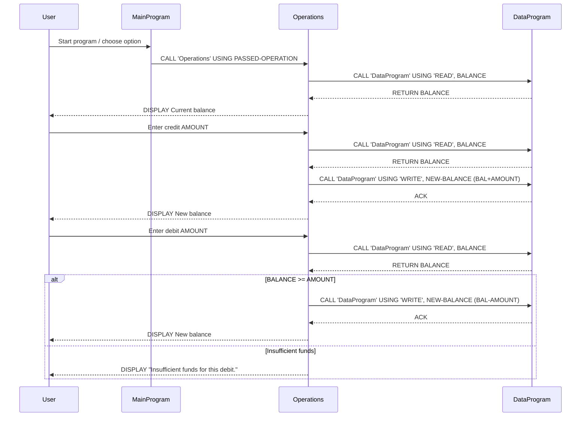

# COBOL Student Account System

This repository contains a small legacy COBOL account management example. The programs implement a simple account (student account) balance system with read/write persistence simulated via internal storage variables and a menu-driven console UI.

**Files and purpose**
- **`src/cobol/data.cob`**: Responsible for storing and retrieving the account balance. Exposes a procedure division using parameters `PASSED-OPERATION` and `BALANCE` and supports two operations: `READ` (returns stored balance) and `WRITE` (updates stored balance).
- **`src/cobol/main.cob`**: Top-level menu and program flow. Presents the user with options: View Balance (1), Credit Account (2), Debit Account (3), Exit (4). It calls `Operations` with the corresponding operation string.
- **`src/cobol/operations.cob`**: Implements the business operations: display total balance, credit an amount, and debit an amount. It calls `DataProgram` to read or write the balance.

**Key procedures / flow**
- `MainProgram` (`main.cob`)
  - Displays menu and accepts `USER-CHOICE` (PIC 9).
  - Calls `Operations` with one of the fixed operation strings: `'TOTAL '`, `'CREDIT'`, `'DEBIT '`.

- `Operations` (`operations.cob`)
  - Receives `PASSED-OPERATION` and moves it into `OPERATION-TYPE`.
  - If `OPERATION-TYPE = 'TOTAL '`:
    - Calls `DataProgram` with `'READ'` to fetch balance and displays it.
  - If `OPERATION-TYPE = 'CREDIT'`:
    - Prompts and accepts `AMOUNT`, reads current balance, adds `AMOUNT`, writes back using `'WRITE'`, and displays the new balance.
  - If `OPERATION-TYPE = 'DEBIT '`:
    - Prompts and accepts `AMOUNT`, reads current balance, checks funds, subtracts and writes back when sufficient, otherwise displays an "Insufficient funds" message.

- `DataProgram` (`data.cob`)
  - Holds `STORAGE-BALANCE` (PIC 9(6)V99) initialised to `1000.00`.
  - Supports `READ` to move `STORAGE-BALANCE` to the caller's `BALANCE`, and `WRITE` to update `STORAGE-BALANCE` from the caller.

**Business rules (student accounts)**
- Initial account balance: Default starting balance is 1000.00 (stored in `STORAGE-BALANCE` and mirrored in `FINAL-BALANCE`).
- No overdrafts: Debit operations are permitted only if the current balance is greater than or equal to the requested debit `AMOUNT`. If not, the operation is rejected with the message "Insufficient funds for this debit.".
- Credit operations: Credits are added to the current balance and persisted via the `DataProgram` write operation.
- Amount formats and limits:
  - Monetary fields use `PIC 9(6)V99` (6 integer digits and 2 decimal digits). The maximum storable value is 999999.99.
  - `AMOUNT` inputs must be numeric and fit the `PIC 9(6)V99` range; there is no input validation beyond COBOL numeric field constraints in the current code.
- Operation string matching: The program compares fixed-length operation identifiers (6 characters). Some operation literals include trailing spaces (for example `'TOTAL '` and `'DEBIT '`). Strings must match exactly when calling programs.

**Notes and suggestions**
- Persistence is simulated in-memory via `STORAGE-BALANCE`. To persist across runs, replace `DataProgram` internals with file I/O or a database connector.
- Input validation is minimal: consider adding checks for negative amounts, non-numeric input, and maximum transaction limits.
- Consider normalising operation codes (trim/pad) to avoid reliance on literal trailing spaces.

---
Generated documentation for the COBOL sources: `src/cobol/data.cob`, `src/cobol/main.cob`, `src/cobol/operations.cob`.

## Sequence Diagram

Below is a Mermaid sequence diagram showing the data flow between the user, `MainProgram`, `Operations`, and `DataProgram` for the primary account actions (view, credit, debit).

